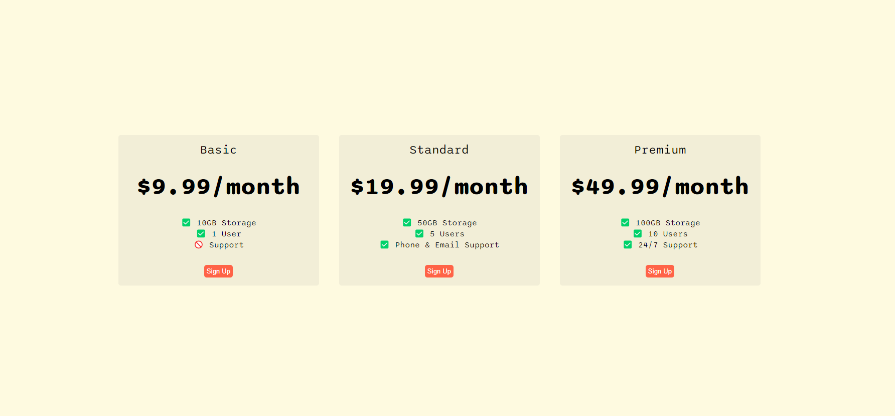

# Flexbox Pricing Table

This project demonstrates a responsive pricing table layout built using HTML and CSS, specifically utilizing **Flexbox** for positioning and alignment. It includes three different pricing plans: Basic, Standard, and Premium. Each plan shows the price and features, and includes a "Sign Up" button.

## Table of Contents
- [Demo](#demo)
- [Technologies Used](#technologies-used)
- [Features](#features)
- [Getting Started](#getting-started)


## Demo
You can view a live demo of the project [here](https://shafayat666.github.io/flexbox-pricing-table/).



## Technologies Used
- **HTML5**: Structuring the content of the webpage.
- **CSS3**: Styling the page and implementing a responsive layout with **Flexbox**.
- **Google Fonts**: Imported the 'Sono' font to enhance the typography.

## Features
- **Responsive Layout**: Adjusts to different screen sizes using Flexbox.
- **Three Pricing Plans**: Basic, Standard, and Premium, each with its own set of features.
- **Customizable**: Easily modifiable to fit different design requirements.
- **Cross-browser Compatibility**: Works well on modern browsers.

## Getting Started

### Prerequisites
To run this project, all you need is a web browser.

### Installation
1. Clone the repository:
    ```bash
    git clone https://github.com/shafayat666/flexbox-pricing-table.git
    ```
2. Navigate to the project directory:
    ```bash
    cd flexbox-pricing-table
    ```
3. Open `index.html` in your browser to view the project.

### Customization
You can customize the pricing table by editing the HTML and CSS:
- To add more pricing plans, simply copy and modify the structure inside the `.pricing-container`.
- Modify the colors, fonts, or layout by changing the values in the CSS file.

## Media Queries
The project includes a basic media query that allows the pricing plans to wrap on smaller screens:
```css
@media (max-width: 1250px) {
    .pricing-container {
        flex-direction: column;
        justify-content: space-around;
        align-items: center;
    }
}
